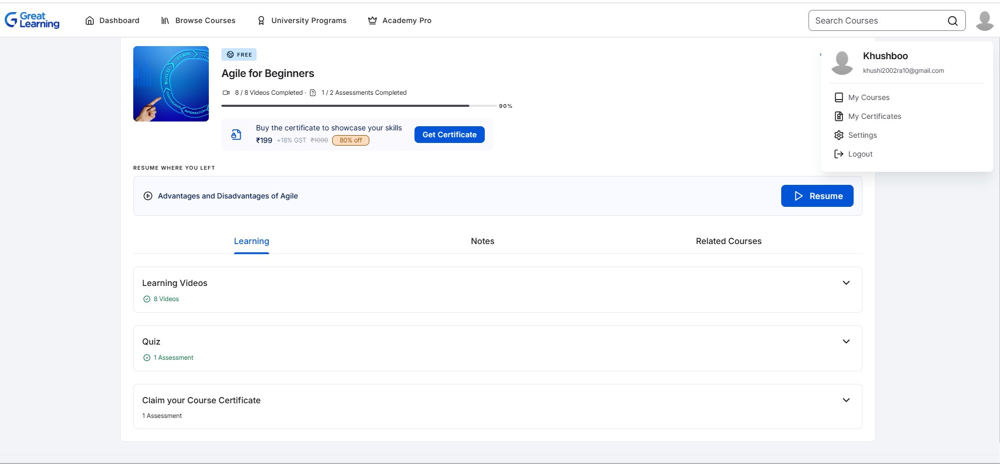
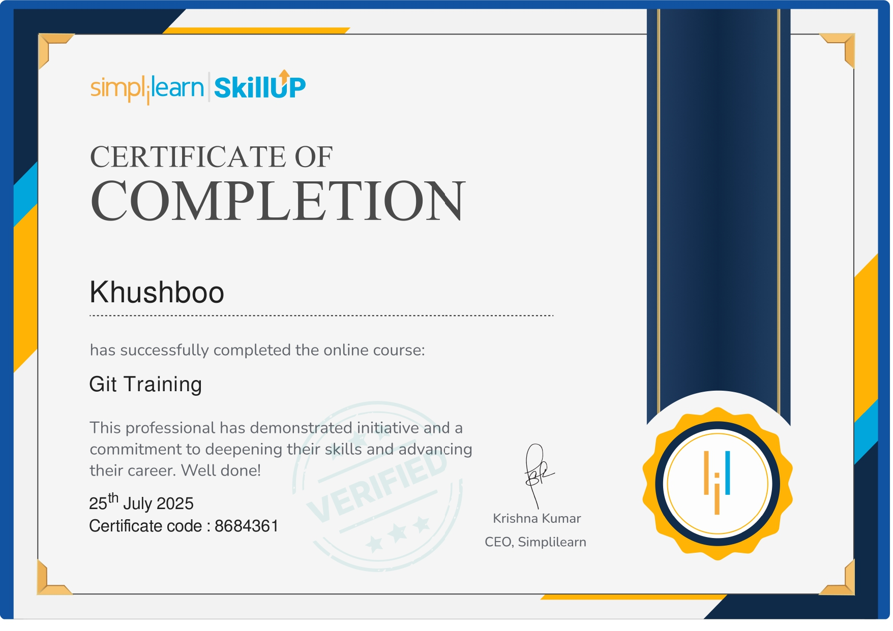
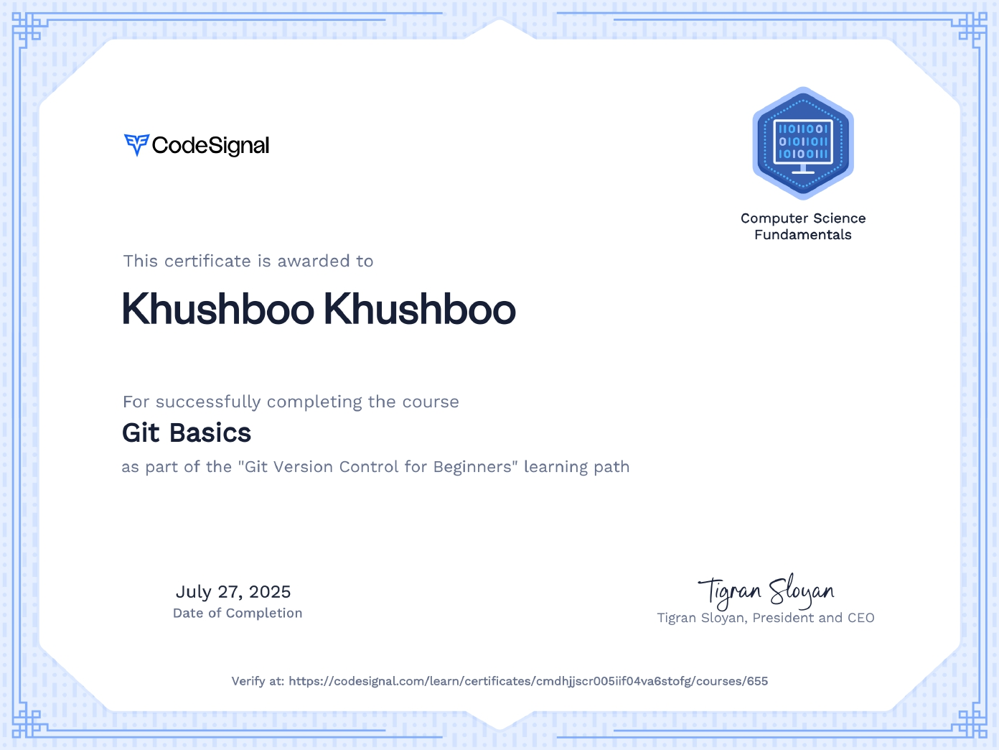

# 5527111_Khushboo 
This repository contains all my hands-on learning with Git and GitHub — including branching, merging, rebasing, tagging, resolving conflicts, and organizing real project files. It's part of my goal to master version control for modern software development.

"Agile for Beginners Certificate from Great Learning"

"Git Training Certificate from Simplilearn"

"Git Basics Certificate from CodeSignal"

